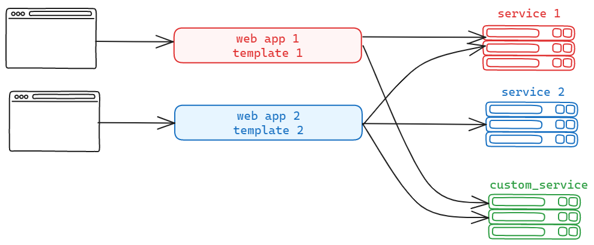
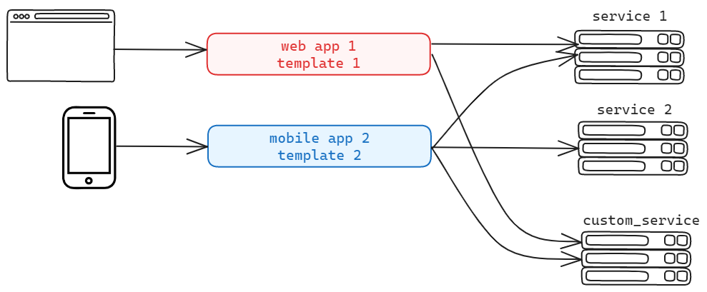

# GraphQL Multi-Service Example

This simple example demonstrates communication between two Flask services using GraphQL.

A Backend For Frontend is a pattern where a separate backend service is specifically designed to cater to the needs of a particular frontend or client application. In your case, service_2 could be considered a BFF if its primary purpose is to aggregate or adapt data from service_1 for consumption by a specific frontend application.

The BFF pattern helps in keeping the frontend and backend concerns separate, allowing for more flexibility, scalability, and customization tailored to the needs of a particular user interface.


## Project Structure

```markdown
├── service_1/
│   ├── app.py
│   └── templates/
│       └── index.html
├── service_2/
│   ├── app.py
│   └── templates/
│       └── index.html
├── venv/
├── requirements.txt
└── README.md
```

## Prerequisites

- Python 3.x
- Flask
- Flask-GraphQL
- Watchdog
- Flask-CORS
- requests

## Installation

1. Clone the repository:

   ```bash
   git clone https://github.com/IbLahlou/bff_prototype.git
   cd graphql-multi-service-example
   ```

2. Install dependencies for both services:

   ```bash
   pip install -r requirements.txt
   ```

## Usage

1. Start Service 1:

   ```bash
   cd service_1 && python app.py
   ```

2. Start Service 2:

   ```bash
   cd service_2 && python app.py
   ```

3. Open these links:
- [http://localhost:5002/](http://localhost:5002/) 
- [http://localhost:5000/](http://localhost:5000/)


> you can split terminal 

## Troubleshooting

- Ensure both services are running.
- Verify network settings and firewall rules.


## Video 

## Architecture

- Actual Architecture :



- Desired Architecture :



```

Feel free to adjust it further according to your preferences!